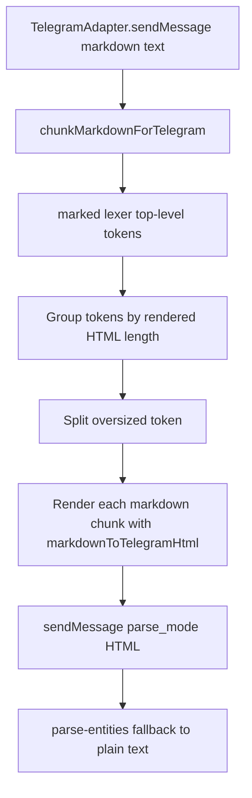

# Telegram Markdown-first Chunking Design

## Architecture Overview

The adapter moves chunking ahead of rendering. A new chunking helper uses `marked` lexer tokens to keep source Markdown boundaries, renders each candidate with `markdownToTelegramHtml`, and only emits chunks whose rendered HTML fits the Telegram limit. `TelegramAdapter` then sends those already-valid HTML chunks using the existing parse mode and fallback path.

## Data Models

- Markdown input: raw string passed to `TelegramAdapter.sendMessage`.
- Marked token: top-level `Tokens.Generic` from `marked.lexer(markdown)`.
- Markdown chunk: source Markdown string that can be rendered independently.
- Rendered chunk: Telegram-compatible HTML string produced by `markdownToTelegramHtml(markdownChunk)`.

## API Design

Internal helper:

- `chunkMarkdownForTelegram(markdown: string, maxLen: number): string[]`
  - Returns rendered Telegram HTML chunks.
  - Throws only if the renderer/lexer fails before fallback can handle it.
  - Does not expose new public package APIs.

Adapter flow:

1. Try Markdown-first chunking.
2. Send each rendered chunk with `{ parse_mode: 'HTML' }`.
3. If Telegram rejects a chunk with `can't parse entities`, send plain text derived from that rendered chunk.
4. If Markdown lexing/rendering throws before chunks are produced, preserve the existing source/plain text fallback in max-length chunks.

## Component Breakdown

- `packages/channel-connector/src/adapters/TelegramAdapter.ts`
  - Replace rendered-HTML chunking with Markdown-first chunking.
  - Keep `htmlToPlainText`, parse-entities detection, and plain text fallback.
- `packages/channel-connector/src/utils/telegramHtml.ts`
  - Keep existing renderer unchanged.
  - Export or reuse `marked` lexer only if it helps avoid duplicate configuration.
- `packages/channel-connector/src/__tests__/adapters/TelegramAdapter.test.ts`
  - Add behavior tests for long code fences, nested list code, paragraphs, Unicode/emoji, and unchanged normal markdown.

## Design Decisions

- Chosen: use `marked` lexer/token raw source and render candidate Markdown chunks for validation.
  - Trade-off: simple and aligned with current dependency, but requires recursive split heuristics for oversized tokens.
- Alternative: chunk rendered HTML with an HTML parser.
  - Rejected because the user asked to chunk Markdown/source before rendering and because Telegram HTML validity depends on rendering each chunk independently.
- Alternative: convert to Telegram MessageEntity.
  - Rejected by explicit requirement.

## Splitting Strategy

- Top-level token grouping: append token raw source to the current candidate when its rendered HTML fits.
- Oversized code token: split by lines, wrapping every chunk in a fenced block using the original language.
- Oversized list token: split by list items, reusing item raw source where available; if an item remains oversized, split that item recursively.
- Oversized paragraph/text token: split raw paragraph content by newline, then sentence punctuation, then word, while validating rendered length.
- Fallback: hard split source/plain text if rendering a chunk still cannot fit, then send without parse mode only for that fallback path.

## Non-Functional Requirements

- Reliability: each parse-mode send is independently rendered HTML.
- Performance: rendering candidates is acceptable because Telegram sends are already network-bound and messages are small relative to process memory.
- Security: continue escaping HTML through the existing renderer; do not pass raw HTML through.
- Maintainability: keep chunking local to the Telegram adapter and use `marked` tokens rather than ad hoc Markdown parsing.
