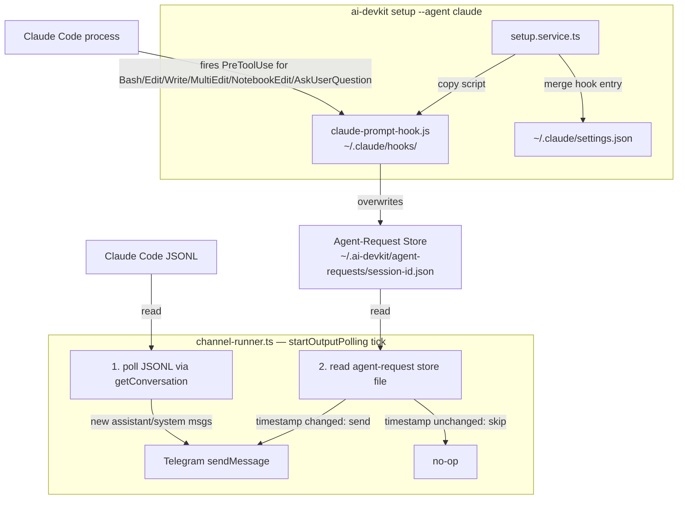

# System Design & Architecture

## Verified Hook Assumptions

| Assumption | Status | Evidence |
|---|---|---|
| A1: `Notification` hook exists | ❌ FALSE | Real Claude plugin hooks.json files show only: `PreToolUse`, `PostToolUse`, `Stop`, `UserPromptSubmit`, `SessionStart` |
| A2: payload includes `session_id` | ✅ CONFIRMED (PreToolUse) | `security_reminder_hook.py:529`: `session_id = input_data.get("session_id")` |
| A3: settings.json hooks schema | ✅ CONFIRMED | Multiple plugin hooks.json files confirm `{ hooks: { Event: [{ matcher?, hooks: [{type,command,timeout}] }] } }` |

**Chosen event**: `PreToolUse` with `matcher: "Bash|Edit|Write|MultiEdit|NotebookEdit|AskUserQuestion"`.

### Interactive prompt types and how they surface

| Prompt type | How it surfaces | Captured? |
|---|---|---|
| Tool approval prompt (Bash, Edit, Write, MultiEdit, NotebookEdit) | `PreToolUse` hook fires before tool execution | Yes — hook writes to agent-request store |
| Question / single-select / multi-select prompt (`AskUserQuestion` tool) | `PreToolUse` hook fires with `tool_name: "AskUserQuestion"` and `tool_input.questions` array | Yes — included in hook matcher; forwarded as `[Question] <raw JSON>` (richer formatting is a future PR) |
| Claude Code TUI selection dialog (generated by Claude Code UI layer, not the model) | No hook event fired | No — not hookable; limitation |

## Architecture Overview



**Per-tick flow:**
1. If `sessionFilePath` known: read JSONL, forward new assistant/system messages to Telegram.
2. If `sessionId` known: read `~/.ai-devkit/agent-requests/<sessionId>.json`. If `entry.timestamp` differs from `lastAgentRequestTimestamp`, send the formatted message and update the cursor.

**Deduplication**: The agent-request file is overwritten on every hook invocation. The channel runner tracks `lastAgentRequestTimestamp` and only forwards entries whose `timestamp` field has changed since the previous tick.

## Data Models

### Agent-Request Store Entry (`~/.ai-devkit/agent-requests/<session-id>.json`)
```ts
// @ai-devkit/agent-manager — AgentRequest
interface AgentRequest {
  sessionId: string;
  toolName: string;           // e.g. "Bash", "AskUserQuestion"
  toolInput: Record<string, unknown>; // e.g. { command: "ls /tmp" } for Bash; { questions: [{question, header, options: [{label, description}], multiSelect}] } for AskUserQuestion
  timestamp: string;          // ISO 8601 — used as the dedup key
}
```
One flat file per session; the hook script overwrites it on each invocation. The `timestamp` field distinguishes distinct tool calls.

### Claude Code `PreToolUse` Hook Payload (stdin JSON)
```ts
interface PreToolUsePayload {
  session_id: string;        // UUID, confirmed present
  tool_name: string;         // e.g. "Bash", "AskUserQuestion"
  tool_input: Record<string, unknown>; // e.g. { command: "ls /tmp" }
}
```

### `~/.claude/settings.json` after setup
```json
{
  "hooks": {
    "PreToolUse": [
      {
        "matcher": "Bash|Edit|Write|MultiEdit|NotebookEdit|AskUserQuestion",
        "hooks": [{ "type": "command", "command": "node ~/.claude/hooks/claude-prompt-hook.js", "timeout": 10 }]
      }
    ]
  }
}
```

## Component Breakdown

### 1. `hooks/claude/claude-prompt-hook.js` (also copied to `packages/cli/assets/claude/`)
CJS script, dependency-free:
- Reads `process.stdin`; skips if TTY.
- Parses JSON; extracts `session_id`, `tool_name`, `tool_input`.
- Sanitizes `session_id` (alphanumeric + hyphens only).
- Creates `~/.ai-devkit/agent-requests/` directory.
- Overwrites `~/.ai-devkit/agent-requests/<session-id>.json` with the current entry.
- **Always exits 0** — never disrupts Claude Code.

### 2. `packages/cli/assets/claude/settings-hook.json`
Settings fragment for the `PreToolUse` hook (merged during setup):
```json
{ "matcher": "Bash|Edit|Write|MultiEdit|NotebookEdit|AskUserQuestion", "hooks": [{ "type": "command", "command": "node ~/.claude/hooks/claude-prompt-hook.js", "timeout": 10 }] }
```

### 3. `setup.service.ts` — `claude` agent definition
```
agent: 'claude', dotFolder: '.claude'
steps:
  - claude-prompt-hook  // copy script + merge PreToolUse entry (idempotent)
  - built-in-skills
```

### 4. `packages/agent-manager/src/utils/agent-requests.ts`
Agent/session infrastructure — lives in `agent-manager`, not the CLI:
```ts
interface AgentRequest { sessionId, toolName, toolInput, timestamp }

function getAgentRequestPath(homeDir: string, sessionId: string): string
// returns path.join(homeDir, '.ai-devkit', 'agent-requests', `${sessionId}.json`)

function readLatestAgentRequest(homeDir: string, sessionId: string): AgentRequest | null
// reads the single flat file; returns null if absent or malformed

function writeAgentRequest(homeDir: string, entry: AgentRequest): void
// creates directory if needed; overwrites the file
```
All three are exported from `@ai-devkit/agent-manager`.

### 5. `channel-runner.ts` — `startOutputPolling()` extension

New state:
- `lastAgentRequestTimestamp: string | undefined`
- `home = options.homeDir ?? homedir()`

Per tick, after JSONL polling:
```
if agent.sessionId:
  agentRequest = readLatestAgentRequest(home, agent.sessionId)
  if agentRequest && agentRequest.timestamp !== lastAgentRequestTimestamp:
    send formatPromptMessage(agentRequest.toolName, agentRequest.toolInput)
    lastAgentRequestTimestamp = agentRequest.timestamp
```

`formatPromptMessage` output:
- `AskUserQuestion` with direct `question` field: `[Question] <question text>`
- `AskUserQuestion` with `questions` array (actual Claude Code payload): `[Question] <raw JSON>`
- Other tools: `[Tool prompt] <toolName>:\n<command or JSON>`

## Design Decisions

| Decision | Choice | Rationale |
|---|---|---|
| Hook event | `PreToolUse` (Bash, Edit, Write, MultiEdit, NotebookEdit, AskUserQuestion) | Covers approval prompts for shell/file ops and question/selection prompts; read-only ops excluded to avoid noise |
| Agent-request store location | `packages/agent-manager` | Agent/session infrastructure belongs with the agent layer, not Telegram-specific CLI code |
| Store layout | Single flat file per session (`<sessionId>.json`) | Simpler than per-session directory; overwrite semantics natural for "latest invocation" |
| Deduplication | `timestamp` field comparison | Reliable; distinct hook invocations always produce distinct ISO timestamps |
| No PID guard | Removed | Claude-specific; makes the polling logic agent-agnostic and simpler to extend |
| Send ordering | JSONL first, agent-request store second | Avoids interleaving; assistant responses always precede the tool notification that caused them |
| `OutputPollingOptions.homeDir` | Injectable for tests | Keeps prod code clean; tests use temp dirs without touching real `~/.ai-devkit/` |

## Non-Functional Requirements

- **Latency**: Agent-request notification reaches Telegram within ≤ 4 s (hook write + one poll tick).
- **Reliability**: Hook always exits 0; errors silently swallowed.
- **Idempotency**: `ai-devkit setup --agent claude` re-run does not duplicate hook entry.
- **Security**: `session_id` sanitized before use as filename; writes only to `~/.ai-devkit/`.
- **No regression**: Existing JSONL polling path unchanged.
- **Agent-agnostic**: Polling logic uses no Claude-specific APIs (no PID files).
