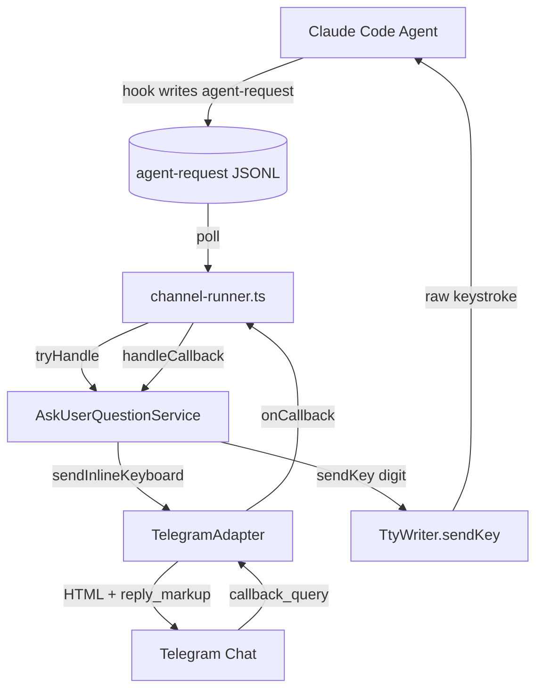

# System Design & Architecture

## Architecture Overview



| Component | Responsibility |
|---|---|
| `channel-runner.ts` | Orchestrate. Route `AskUserQuestion` to the service; register adapter callback handler; inject `TtyWriter.sendKey` as the agent-write callback. |
| `AskUserQuestionService` (new, in `ask-user-question.ts`) | Parse input, render the keyboard (numbered options + Skip for single-select; Skip-only for multi-select), track an in-memory session per `questionId`, resolve the digit or Esc on tap, write to the agent. |
| `TelegramAdapter` | Adds 4 methods: `sendInlineKeyboard`, `editInlineKeyboard`, `answerCallback`, `onCallback`. |
| `TtyWriter.sendKey` (new) | Send a single raw keystroke to the agent's terminal, bypassing bracketed paste and auto-Enter. Translates the Esc byte (`\x1b`) to the backend-native representation. |

## Data Models

```ts
// ask-user-question.ts (internal)

interface QuestionOption {
    label: string;
    description?: string;
}

interface QuestionSpec {
    question: string;
    header?: string;
    options: QuestionOption[];
    multiSelect: boolean;
}

interface ActiveSession {
    questionId: string;     // short base36 counter, never sent to agent
    chatId: string;
    spec: QuestionSpec;
    messageId: number | null;
}

// callback_data encoding (≤64 bytes):
//   q:<questionId>:o:<optionIdx>   — option tap (single-select keyboards only)
//   q:<questionId>:skip            — Skip tap (every keyboard)
// questionId is a base36 counter (1-2 chars); optionIdx is decimal — both well under 64 bytes.
```

```ts
// channel-connector/src/types.ts (new exports)

export interface InlineKeyboardButton {
    text: string;
    callbackData: string;
}
export type InlineKeyboard = InlineKeyboardButton[][]; // rows of buttons

export interface IncomingCallback {
    channelType: string;
    chatId: string;
    userId: string;
    messageId: number;
    callbackData: string;
    callbackQueryId: string;
    timestamp: Date;
}
export type CallbackHandler = (callback: IncomingCallback) => Promise<void>;
```

## API Design

### TelegramAdapter additions

```ts
class TelegramAdapter implements ChannelAdapter {
    // existing: start, stop, sendMessage, onMessage, isHealthy

    /** Send a message with an inline keyboard. Returns the Telegram message_id. */
    async sendInlineKeyboard(chatId: string, html: string, keyboard: InlineKeyboard): Promise<number>;

    /** Replace (or remove with `null`) the keyboard on an existing message. */
    async editInlineKeyboard(chatId: string, messageId: number, keyboard: InlineKeyboard | null): Promise<void>;

    /** Ack a callback_query, optionally with a transient toast. */
    async answerCallback(callbackQueryId: string, text?: string): Promise<void>;

    /** Register a handler for inline-keyboard taps. */
    onCallback(handler: CallbackHandler): void;
}
```

`ChannelAdapter` (the abstract interface) stays minimal — keyboard methods live only on the concrete `TelegramAdapter`. Promote to the interface if a second platform needs them.

### TtyWriter addition

```ts
class TtyWriter {
    static async send(location, message): Promise<void>;     // existing: bracketed paste + Enter
    static async sendKey(location, key): Promise<void>;       // NEW: raw single keystroke
}
```

- **tmux** path: `tmux send-keys -t <id> <key>` — direct, no paste buffer.
- **iTerm2 / Terminal.app**: focus the target session/tab, then `tell application "System Events" to keystroke "<key>"`. Requires macOS Accessibility permission.

### ask-user-question.ts service

```ts
export class AskUserQuestionService {
    constructor(telegram: KeyboardChannel, sendToAgent: SendToAgent);

    /** Returns true if it owned the request; false → caller falls back to plain text. */
    tryHandle(toolInput: Record<string, unknown>, chatId: string): Promise<boolean>;

    /** Resolve an inline-keyboard tap, write the digit to the agent, clear the keyboard. */
    handleCallback(cb: IncomingCallback): Promise<void>;
}
```

`KeyboardChannel` is a 3-method subset of `TelegramAdapter` (`sendInlineKeyboard`, `editInlineKeyboard`, `answerCallback`) — kept narrow so unit tests can supply a tiny stub.

`SendToAgent = (key: string) => Promise<void>` — in production wired to `(key) => TtyWriter.sendKey(terminalLocation, key)`.

## Component Breakdown

- `packages/channel-connector/src/types.ts` — add `InlineKeyboardButton`, `InlineKeyboard`, `IncomingCallback`, `CallbackHandler`.
- `packages/channel-connector/src/index.ts` — re-export new types.
- `packages/channel-connector/src/adapters/TelegramAdapter.ts` — 4 new methods + `bot.on('callback_query', ...)` wiring.
- `packages/agent-manager/src/terminal/TtyWriter.ts` — new `sendKey` static method (tmux + iTerm2 + Terminal.app paths).
- `packages/cli/src/services/channel/ask-user-question.ts` (new) — service, parser, formatter, keyboard builder, escape helper.
- `packages/cli/src/services/channel/channel-runner.ts`:
  - `startOutputPolling` accepts optional `askUserQuestionService`.
  - Polling loop offers `AskUserQuestion` payloads to the service; on `false` (multi-question / malformed) falls back to `formatPromptMessage`.
  - `runChannelBridge` constructs the service with `TtyWriter.sendKey` and registers `telegram.onCallback`.

## Design Decisions

- **Single-question scope.** Multi-question payloads require sequencing keystrokes across pickers with timing assumptions; we reject them at the parser and fall back to plain `[Question]` text where the user can free-text reply.
- **Multi-select is supported as Skip + chat reply, not toggle/Submit.** Driving multi-select toggles through the picker is just as fragile as multi-question. Instead, render the question and numbered options as a read-only formatted message with a `Skip`-only keyboard, plus a hint asking the user to reply in chat. The existing `onMessage` → `TtyWriter.send` path delivers the typed reply.
- **Skip on every keyboard.** A `Skip` button is appended to every keyboard. On tap it sends the Esc byte (`\x1b`) via `sendKey`, which translates per backend (tmux `Escape`, AppleScript `key code 53`, wezterm literal byte).
- **Digit keystroke via `sendKey`, not text via `send`.** The host picker reads stdin in raw mode. `TtyWriter.send` wraps payloads in bracketed paste markers `\e[200~ ... \e[201~`, which the inner TUI routes to the focused text input ("Other"), not to the picker's digit hotkey. `sendKey` sends a raw keystroke that the picker captures and selects+confirms immediately. Free-text replies (for the multi-select chat-reply path) intentionally use `send` so they reach the picker's text-input field.
- **Process-memory state.** Bridge restart drops in-flight questions; on tap of a stale button we ack with a "Question expired" toast. Acceptable per requirements; avoids file-IO complexity.
- **`questionId` is a short base36 counter.** Keeps `callback_data` ≤64 bytes and contains no PII.
- **HTML escaping at the body builder.** Telegraf does not auto-escape; all user-controlled fields go through `escapeHtml` before insertion.
- **Defense-in-depth on `chatId`.** The adapter delivers all callbacks; the runner filters by `chatIdRef.value`; the service re-checks `session.chatId`. Three independent gates.
- **Keep `ChannelAdapter` interface minimal.** Inline keyboards are Telegram-specific; the runner imports `TelegramAdapter` directly. Revisit if a second adapter needs them.

## Non-Functional Requirements

- **Performance.** Callbacks are human-rate. No batching needed.
- **Security.** HTML-escape every user-controlled field; AppleScript-escape every `sendKey` payload; reject callbacks whose `chatId` doesn't match the authorized chat.
- **Reliability.** Callback handler errors must not crash the bridge: every external call (`editInlineKeyboard`, `answerCallback`, `sendToAgent`) is wrapped in try/catch + `debug` logging.
- **Backwards compatibility.** Non-AskUserQuestion tool prompts unchanged. The legacy plain-text `[Question] <text>` path remains as the fallback.
