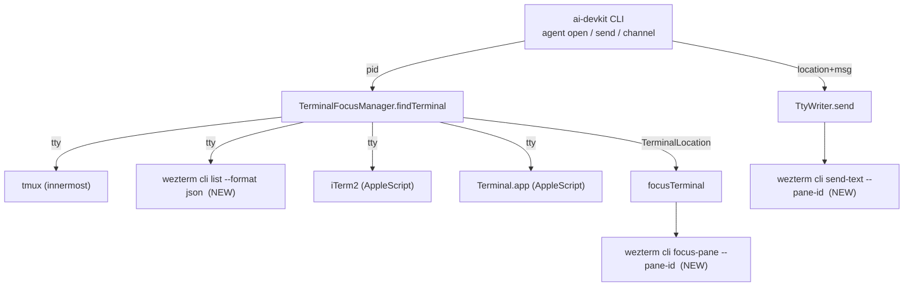

# System Design & Architecture

## Architecture Overview
**What is the high-level system structure?**

Terminal control is isolated in `packages/agent-manager/src/terminal/`. The CLI
(`agent open`, `agent send`, channel bridges) only depends on three abstractions:
`TerminalFocusManager.findTerminal/focusTerminal` and `TtyWriter.send`. Adding a
new emulator means extending these three — no CLI change is required.

- Key components
  - `TerminalType` enum — gains a `WEZTERM` member.
  - `TerminalFocusManager` — gains WezTerm discovery + focus.
  - `TtyWriter` — gains a WezTerm send branch.
- WezTerm is controlled entirely through its `wezterm` CLI (no AppleScript), so
  the same code works on macOS, Linux, and Windows.

## Data Models
**What data do we need to manage?**

- `TerminalType` enum: add `WEZTERM = 'wezterm'`.
- `TerminalLocation` (unchanged shape):
  - `type: TerminalType.WEZTERM`
  - `identifier: string(paneId)` — WezTerm's global pane id (e.g. `"7"`), used
    by `activate-pane --pane-id` and `send-text --pane-id`.
  - `tty: string` — `/dev/...` device, for parity with other emulators.

## API Design
**How do components communicate?**

Discovery and control happen via `execFile('wezterm', [...])` (promisified). No
shell is used, so there is no string interpolation. Prompt text is written to
`send-text` over stdin instead of argv, keeping message contents out of local
process listings while preserving shell-injection safety.

- Discover pane: `wezterm cli list --format json`
  - Parse JSON array; find entry whose **`tty_name`** equals the target
    `/dev/...` (the JSON field is `tty_name`, not `tty`).
  - Return `{ type: WEZTERM, identifier: String(pane_id), tty }`.
- Focus pane: `wezterm cli activate-pane --pane-id <id>` → success on zero exit.
- Send text: two explicit `wezterm cli send-text --pane-id <id>` calls.
  - Step 1 (text): `send-text --pane-id <id>` with the message body written to
    stdin.
  - Step 2 (Enter): a single carriage return byte (0x0d) as an argv element
    with `--no-paste`. The equivalent shell command is
    `wezterm cli send-text --pane-id <id> --no-paste $'\x0d'` (note the
    dollar-single-quoted `$'\x0d'`), so the CR is delivered literally rather
    than wrapped in paste brackets.
  - 150 ms pacing between the two, mirroring the tmux/iTerm/Terminal
    convention so a bracketed-paste-aware TUI still sees Enter as a submit.

## Component Breakdown
**What are the major building blocks?**

- `src/terminal/TerminalFocusManager.ts`
  - `findTerminal`: insert WezTerm check **after tmux, before iTerm2**.
    (tmux-inside-wezterm still resolves to tmux; cross-platform WezTerm is tried
    before macOS-only AppleScript probes.)
  - `findWeztermPane(tty)`: call `wezterm cli list --format json`, JSON-parse,
    match `tty_name`, return location or `null`. Swallow ENOENT/parse/non-zero.
  - `focusWeztermPane(paneId)`: `wezterm cli activate-pane --pane-id <id>`.
  - Optional `debug` logger (constructor): emits one line per discovery/focus
    step (pid/tty, each probe's match/no-match, focus result) so the
    `agent open --debug` command can show the decision path.
- `src/terminal/TtyWriter.ts`
  - `send`: add `WEZTERM` case → `sendViaWezterm(identifier, message)`.
  - `sendViaWezterm`: text via stdin, then a CR byte (0x0d) with `--no-paste`
    — 150 ms apart; throws a descriptive error on failure.
- `src/terminal/index.ts`: no change (`TerminalType` already re-exported).
- CLI: no change — it consumes the abstract API only.

## Design Decisions
**Why did we choose this approach?**

- **CLI-over-AppleScript.** WezTerm is cross-platform and ships a stable CLI.
  Reusing it avoids macOS-only scripting and matches how tmux is handled.
- **Discovery by TTY from `cli list --format json`.** JSON is stable to parse;
  TTY matching reuses the exact identity model of the other emulators.
- **Two-step text + Enter.** Keeps identical semantics to the three existing
  senders (documented to survive bracketed-paste TUIs) and avoids special-casing.
- **Graceful degradation.** `wezterm` missing/failed is caught exactly like the
  tmux probe, so behavior for non-WezTerm users is unchanged.
- Alternatives considered
  - Parsing the human-readable `cli list` table — fragile across versions;
    rejected in favor of `--format json`.
  - WezTerm GUI app process-name sniffing — differs by platform
    (`wezterm-gui` vs bundled `wezterm`); rejected; we let `cli list` be the
    source of truth and catch failure.
  - Single-step send (text + newline together) — rejected for consistency with
    the documented two-step convention used everywhere else.

## Non-Functional Requirements
**How should the system perform?**

- Performance: one extra short-lived subprocess probe on `findTerminal` only when
  earlier probes miss; same O(processes) cost profile as today.
- Security: no shell invocation; the message is written through stdin so it is
  not exposed through process arguments, shell metacharacters remain data, and
  Enter is a fixed CR byte.
- Reliability: every WezTerm path is wrapped so a missing binary, a failed JSON
  parse, or a non-running instance returns `null`/`false`/throws-with-context
  instead of crashing the CLI.
- Compat: existing emulator tests run unmodified.
