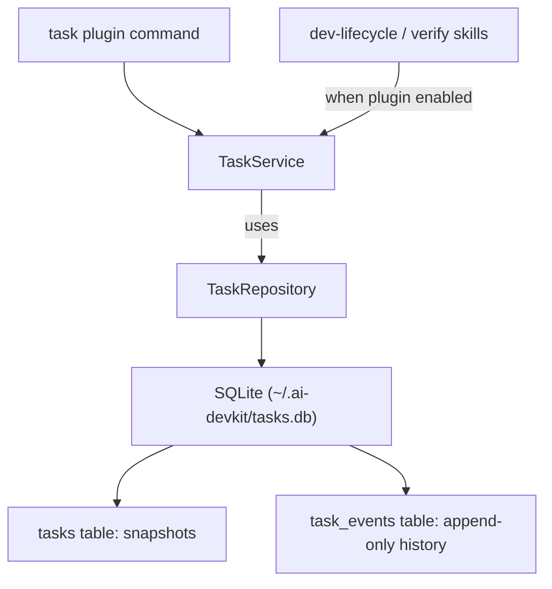

# System Design & Architecture — Task System

## Architecture Overview



- New package `@ai-devkit/task-manager`, structured like `@ai-devkit/memory` for the service
  layer and packaged as an optional AI DevKit plugin for the `task` CLI command.
- **Layering:** plugin CLI and skills call `TaskService`, which uses `TaskRepository` for
  persistence. Callers never touch the database directly.
- **SQLite** (via `better-sqlite3`, the same library `@ai-devkit/memory` uses) stores a
  `tasks` table of snapshots and a `task_events` table for the append-only event history.

## Data Models

### Actor (attribution unit — reused on events and as task owner)

```ts
interface Actor {
  agentId?: string;     // agent id from the agent-manager registry, if any
  agentType?: string;   // e.g. "claude" | "codex" | "pi" | "human"
  pid?: number;
  sessionId?: string;   // agent session id, if known
}
```

### Task (snapshot — authoritative for reads)

```ts
type TaskStatus = "open" | "active" | "blocked" | "completed" | "abandoned";
type LifecyclePhase = string | null; // free-form; recommended:
// requirements | design | planning | implementation | testing | review

interface TaskProgress { text: string | null; percent: number | null; } // percent 0..100

interface TaskLinks {
  branch?: string; worktree?: string; pr?: string; commits?: string[];
}

interface TaskBlocker {
  blockerId: string;   // raw UUIDv4
  text: string;
  status: "open" | "resolved";
  raisedAt: string;    // ISO 8601
  resolvedAt: string | null;
  raisedBy: Actor | null;
}

interface TaskEvidence {
  evidenceId: string;  // raw UUIDv4
  command: string | null;
  exitCode: number | null;
  passed: boolean;     // true = pass/success, false = fail
  summary: string | null;
  artifacts: string[]; // artifactId refs and/or free path strings
  recordedAt: string;
  actor: Actor | null;
}

interface TaskArtifact {
  artifactId: string;  // raw UUIDv4
  path: string;        // reference only — never copied into storage
  kind: string | null; // "log" | "report" | "diff" | "screenshot" | ...
  description: string | null;
  addedAt: string;
}

interface Task {
  // identity
  taskId: string;          // raw UUIDv4; immutable, never reused
  title: string;
  summary: string | null;
  feature: string | null;  // kebab-case feature key (nullable for ad-hoc tasks)
  // state
  status: TaskStatus;
  phase: LifecyclePhase;
  phaseEnteredAt: string | null;
  progress: TaskProgress;
  nextStep: string | null;
  blockers: TaskBlocker[];
  evidence: TaskEvidence[];
  artifacts: TaskArtifact[];
  // ownership / links
  attribution: Actor | null;   // current owner; per-event emitter is on each event
  links: TaskLinks;
  tags: string[];
  meta: Record<string, string | number | boolean | null>; // free-form extras
  // bookkeeping
  createdAt: string;
  updatedAt: string;
  createdBy: Actor | null;
  eventCount: number;          // cached count derived from task_events
  lastEventAt: string | null;  // cached, derived
}
```

All fields are persisted in the task snapshot (the `tasks` table stores the full Task as
JSON plus indexed query columns) and authoritative for reads. The full event timeline is
read on demand from the `task_events` table via `getEvents()`; `eventCount`/`lastEventAt`
are cached on the snapshot for cheap listing.

### TaskEvent (one row in the `task_events` table)

```ts
interface TaskEvent {
  eventId: string;       // raw UUIDv4
  taskId: string;
  ts: string;            // ISO 8601
  type: TaskEventType;   // see table below
  actor: Actor | null;   // who emitted this event, when provided by the caller
  payload: Record<string, unknown>;  // shape depends on type
}
```

### Event types

| `type` | Mutates snapshot? | Payload shape |
|---|---|---|
| `task.created` | yes (init) | `{ title, feature?, summary?, status, phase? }` |
| `task.updated` | yes | `{ patch: Partial<Task-scalar-fields>, fields: string[] }` (title/summary/tags/links/meta) |
| `task.phase.set` | yes | `{ phase, previous? }` |
| `task.status.set` | yes | `{ status, previous? }` |
| `task.progress.set` | yes | `{ text?, percent? }` |
| `task.next_step.set` | yes | `{ step: string \| null }` |
| `task.blocker.add` | yes | `{ blockerId, text }` |
| `task.blocker.resolve` | yes | `{ blockerId }` |
| `task.evidence.add` | yes | `{ evidenceId, command?, exitCode?, passed, summary?, artifacts? }` |
| `task.artifact.add` | yes | `{ artifactId, path, kind?, description? }` |
| `task.attribution.set` | yes | `{ agentId?, agentType?, pid?, sessionId? }` |
| `task.note.append` | no (event-only) | `{ text }` |
| `task.custom` | no (event-only) | `{ name: string, data?: object }` — observability escape hatch; never mutates state |
| `task.closed` | yes | `{ status: "completed" \| "abandoned" }` |

Stateful types mutate the snapshot **and** append the event. `task.note.append` and
`task.custom` append the event only.

## API Design

### `TaskService` (public API consumed by CLI and skills)

All methods async. Every mutator accepts an optional `opts?: { actor?: Actor }`; if omitted,
the event actor is stored as `null` (see Attribution). Every mutator returns the updated `Task`
snapshot unless noted.

```ts
class TaskService {
  constructor(repository: TaskRepository);

  // identity / lookup
  create(input: { title: string; feature?: string; summary?: string;
                  phase?: LifecyclePhase; tags?: string[]; links?: TaskLinks;
                  meta?: Record<string, string|number|boolean|null>; actor?: Actor; }): Promise<Task>;
  get(taskId: string): Promise<Task>;                       // throws TaskNotFoundError
  resolveTask(ref: string | { feature: string } | { taskId: string }): Promise<Task | null>;
  list(filter?: { feature?: string; status?: TaskStatus; phase?: LifecyclePhase;
                  limit?: number }): Promise<Task[]>;

  // generic scalar patch -> task.updated
  update(taskId: string, patch: { title?: string; summary?: string; tags?: string[];
           links?: Partial<TaskLinks>; meta?: Record<string, string|number|boolean|null>; },
         opts?): Promise<Task>;

  // dedicated state setters (each emits its specific event)
  setPhase(taskId: string, phase: LifecyclePhase, opts?): Promise<Task>;
  setStatus(taskId: string, status: TaskStatus, opts?): Promise<Task>;
  setProgress(taskId: string, progress: { text?: string | null; percent?: number | null }, opts?): Promise<Task>;
  setNextStep(taskId: string, step: string | null, opts?): Promise<Task>;

  // blockers / evidence / artifacts / attribution
  addBlocker(taskId: string, input: { text: string }, opts?): Promise<{ task: Task; blockerId: string }>;
  resolveBlocker(taskId: string, blockerId: string, opts?): Promise<Task>;
  addEvidence(taskId: string, input: { command?: string; exitCode?: number; passed: boolean;
               summary?: string; artifacts?: string[] }, opts?): Promise<{ task: Task; evidenceId: string }>;
  addArtifact(taskId: string, input: { path: string; kind?: string; description?: string }, opts?): Promise<{ task: Task; artifactId: string }>;
  setAttribution(taskId: string, actor: Actor, opts?): Promise<Task>;

  // notes / lifecycle
  addNote(taskId: string, text: string, opts?): Promise<Task>;   // event-only
  close(taskId: string, status: "completed" | "abandoned", opts?): Promise<Task>;

  // low-level event append (used internally by the setters above)
  addEvent(taskId: string, type: TaskEventType, payload: Record<string, unknown>, opts?): Promise<TaskEvent>;
  getEvents(taskId: string, filter?: { type?: TaskEventType; limit?: number }): Promise<TaskEvent[]>;
}

function createTaskService(dbPath?: string): TaskService;
```

`addEvent` applies the matching snapshot mutation for a stateful type then appends; for
`task.note.append` / `task.custom` it appends only. Callers use
`addEvent(id, "task.custom", { name, data })` to record observability without changing state.

### `resolveTask` reference resolution

`resolveTask(ref)` and the CLI `<id>` argument accept, in order:
1. a full `taskId` (raw UUID);
2. a unique `taskId` **prefix** — error if ambiguous;
3. a **feature key** → the latest **non-terminal** task whose `feature === ref`.

This powers "the current task for this feature" for dev-lifecycle/verify without requiring
callers to remember ids.

## Plugin CLI (`ai-devkit task ...`)

The `task` command is available after installing and enabling `@ai-devkit/task-manager` as an
AI DevKit plugin. All commands accept global flags `--db-path <path>` (explicit DB path override), `--json`
(machine output), and attribution overrides `--agent <id>`, `--agent-type <t>`, `--pid <n>`,
`--session <s>`. By default, the plugin resolves project `.ai-devkit.json` `tasks.path`, then
falls back to `~/.ai-devkit/tasks.db`. `<id>` resolves per `resolveTask` above.

| Command | Flags | Emits |
|---|---|---|
| `task create` | `--title <t>` `--feature <f>` `--summary <s>` `--phase <p>` `--tags <csv>` `--branch` `--worktree` `--pr` | `task.created` |
| `task list` | `--feature` `--status` `--phase` `--limit <n>` `--json` (table default) | — |
| `task show <id>` | `--events` `--json` | — |
| `task update <id>` | `--title` `--summary` `--tags` `--branch` `--worktree` `--pr` | `task.updated` |
| `task phase <id> <phase>` | — | `task.phase.set` |
| `task status <id> <status>` | — | `task.status.set` |
| `task progress <id>` | `--text <t>` `--percent <n>` `--clear` | `task.progress.set` |
| `task next <id> <step...>` | `--clear` | `task.next_step.set` |
| `task blocker <id> add <text>` | — | `task.blocker.add` |
| `task blocker <id> resolve <blockerId>` | — | `task.blocker.resolve` |
| `task evidence <id>` | `--command <c>` `--exit-code <n>` `--passed` `--failed` `--summary <s>` `--artifact <path>...` | `task.evidence.add` |
| `task artifact <id> <path>` | `--kind <k>` `--description <d>` | `task.artifact.add` |
| `task assign <id>` | `--agent <id>` `--agent-type <t>` `--pid <n>` `--session <s>` | `task.attribution.set` |
| `task note <id> <text...>` | — | `task.note.append` |
| `task event <id>` | `--type <t>` `--payload <json\|@file>` | `task.custom` / low-level addEvent |
| `task close <id> [completed\|abandoned]` | — | `task.closed` |

## Evidence / Artifact Model

- **Evidence** records a verification result inline: `command`, `exitCode`, `passed` (required,
  boolean), `summary` (inline text — the durable path for output), and `artifacts` (refs). The
  `verify` skill calls e.g. `task evidence <id> --command "nx test" --exit-code 0 --passed
  --summary "all green"`.
- **Artifacts** are **references only** (`path` + optional `kind`/`description`). The repository
  never copies files, keeping tasks lightweight. To capture text durably, put it in evidence
  `summary`; to point at a file, add an artifact ref.

## Attribution Model

- Per-event `actor` records who **emitted** the event; task `attribution` records the **current
  owner** (set via `task.attribution.set` / `task assign`).
- Actor metadata is explicit. Skills and CLI callers may pass `opts.actor` or attribution flags
  (`--agent`, `--agent-type`, `--pid`, `--session`); when no actor is provided, events store
  `null`.

## Feature ↔ Task ↔ Phase

- **One task per feature** is the default model; `phase` is a single field on the task that
  advances through the lifecycle. Callers update the feature task's phase field
  (`task.phase.set`), not one task per phase.
- `feature` is optional (ad-hoc debug tasks may omit it). Multiple tasks may share a feature
  key; `resolveTask(feature)` returns the latest **non-terminal** one. No parent/child
  hierarchy in MVP.
- `phase` is a free-form string (recommended: `requirements|design|planning|implementation|
  testing|review`) so structured-debug and custom workflows are unconstrained.

## Storage Layout

Tasks are stored in a single SQLite database at `~/.ai-devkit/tasks.db`:

- **`tasks`** — one row per task: `task_id` (PK), `snapshot` (the full Task JSON), plus
  indexed `feature`/`status`/`phase`/`created_at`/`updated_at` columns for queryability and
  DB inspection.
- **`task_events`** — append-only event history: one row per event (`id` for stable insertion
  order, `event_id` unique natural key; `actor`/`payload` stored as JSON text).

Task and event ids are raw UUIDv4 strings from Node `crypto.randomUUID()`, stored as TEXT
(36 chars: `8-4-4-4-12` lowercase hex) — globally unique with no prefix, coordination, or collision
checks. Project CLI usage can configure `.ai-devkit.json` `tasks.path` once the plugin is
installed; explicit callers can
override the DB path with `--db-path` or the `TaskRepository` / `DatabaseConnection`
constructor. Only `TaskRepository` reads/writes the database; callers use `TaskService` or
the CLI.

## Design Decisions & Trade-offs

- **Snapshot + append-only events (not pure event sourcing):** reads are a single indexed
  query; events give a full audit trail. Event-sourced rebuild is a documented future capability
  (events already carry enough to reconstruct), deferred to keep MVP simple.
- **SQLite persistence:** `better-sqlite3` (same as `@ai-devkit/memory`) with WAL +
  `busy_timeout` for safe concurrent local access. `TaskRepository` owns the task/event SQL,
  mirroring memory's connection lifecycle (`getDatabase()`/`closeDatabase()`).
- **Raw UUID ids:** task/event (and blocker/evidence/artifact) ids are `crypto.randomUUID()`
  values stored as TEXT — globally unique with no central counter, prefix, or collision checks.
  Creation order is tracked by the indexed `created_at` column, not the id.
- **Dedicated event types over one generic type:** each task state change has a precise event;
  `task.custom` remains for anything not anticipated.
- **`resolveTask` accepts feature key:** dev-lifecycle/verify find "the current task" without
  threading ids through every skill.

## Non-Functional Requirements

- **Atomicity:** each mutation is a single SQLite statement (autocommit); snapshot writes and
  event appends are independent atomic operations. WAL + `synchronous=NORMAL` keep reads
  non-blocking while protecting against crashes.
- **Concurrency:** WAL mode + `busy_timeout=5000ms` allow safe concurrent readers and serialized
  writers across local processes (an upgrade over naive file locking).
- **Portability:** a single portable `tasks.db` SQLite file under `~/.ai-devkit/`, inspectable
  with any SQLite tool.
- **Performance:** indexed `task_id`/`feature`/`status`/`phase` lookups; MVP targets hundreds of
  tasks. (`list` still reads all snapshots in-memory for sort/filter; repository-level filtering is a
  future optimization that needs no API change.)
- **Validation:** strict runtime validation (title non-empty, percent 0..100, known status)
  with typed errors (`TaskNotFoundError`, `TaskValidationError`, `AmbiguousTaskRefError`).
