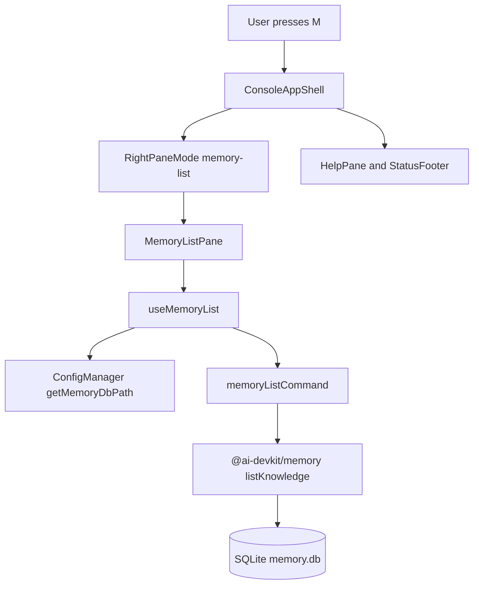

# System Design & Architecture

## Architecture Overview
**What is the high-level system structure?**



The console adds a read-only memory-list right-pane workspace. `ConsoleAppShell` handles the new shortcut only when global console shortcuts are active, sets `RightPaneMode` to a memory-list state, and renders `MemoryListPane` using the same replacement-pane model as help, start agent, rename, and channel selection.

The memory pane loads bounded recent items through a small CLI-side hook that resolves the configured memory database path with existing config behavior and calls `@ai-devkit/memory` list APIs. The TUI does not parse SQLite files directly. Loading starts when the memory pane is opened and can run asynchronously from the Ink render path so existing agent polling and selection remain responsive.

## Data Models
**What data do we need to manage?**

```typescript
interface ConsoleMemoryItem {
  id: string;
  title: string;
  scope: string;
  tags: string[];
  updatedAt: string;
}

type RightPaneMode =
  | ExistingRightPaneMode
  | { type: 'memory-list' };

interface MemoryListState {
  items: ConsoleMemoryItem[];
  total: number;
  isLoading: boolean;
  error: string | null;
  lastUpdated: Date | null;
}
```

- Core source data comes from `KnowledgeItem` returned by `memoryListCommand` / `listKnowledge`.
- The pane projects memory data to terminal-friendly rows: title, scope, tags, and updated time.
- `total` comes from `ListKnowledgeResult.total` and supports compact `+N more` overflow messaging when the pane cannot show every loaded item.
- `lastUpdated` is the pane load time, not a persisted memory property.
- No schema changes or new persistent data are required.

## API Design
**How do components communicate?**

- External APIs:
  - No public network API is added.
  - No command syntax changes outside `ai-devkit agent console` keyboard behavior.
- Internal interfaces:
  - Add `memory-list` to `RightPaneMode`.
  - Add `MemoryListPane` under `packages/cli/src/tui/console`.
  - Add a `useMemoryList` hook or equivalent local loader.
  - Reuse async `ConfigManager.getMemoryDbPath()` to resolve the configured database path.
  - Reuse synchronous `memoryListCommand({ limit, sort: 'updated-desc', dbPath })` after path resolution completes.
- Request/response format:
  - The pane requests a bounded list, proposed default `limit: 20`.
  - The pane renders at most the rows that fit inside its height budget and keeps remaining loaded items in state for future navigation/pagination work.
  - Empty result returns success with no rows and renders an empty state.
  - Exceptions become pane-local error state and do not exit the console.
- Authentication/authorization:
  - No new authentication. The feature reads the same local database that the CLI user can already access.

## Component Breakdown
**What are the major building blocks?**

| Component | Change |
|---|---|
| `packages/cli/src/tui/console/types.ts` | Add `memory-list` right-pane mode and memory item state types if needed |
| `packages/cli/src/tui/console/ConsoleApp.tsx` | Route `M` shortcut, close/toggle memory pane, and render `MemoryListPane` |
| `packages/cli/src/tui/console/MemoryListPane.tsx` | New read-only Ink pane for recent memory items, empty state, loading state, and error state |
| `packages/cli/src/tui/console/hooks/useMemoryList.ts` | Load bounded recent memory items through config-aware memory APIs |
| `packages/cli/src/tui/console/HelpPane.tsx` | Document the `M` memory shortcut |
| `packages/cli/src/tui/console/StatusFooter.tsx` | Include compact `M memory` hint |
| `packages/cli/src/__tests__/tui/console/**` | Cover rendering, shortcut behavior, and regression around existing panes |

The memory package already exposes `memoryListCommand`, so this feature should not add new memory storage or query primitives unless implementation discovers a missing capability.

### Load Behavior

- Opening the memory pane starts a one-shot load.
- Reopening the pane starts a fresh load so recent changes from `ai-devkit memory store/update` can appear without a separate refresh control.
- There is no polling in this feature. Memory data changes far less frequently than agent status, and polling local memory content would add complexity without a clear user benefit.
- If the pane unmounts while a load is in flight, the hook should ignore late results rather than setting state on an inactive component.

## Design Decisions
**Why did we choose this approach?**

- Add a console-native pane instead of launching `memory-dashboard`.
  - The agent console is a terminal supervision workflow. A native pane keeps the user in that workflow.
- Use uppercase `M`.
  - Lowercase `m` already focuses message input. Uppercase keeps the existing shortcut intact.
- Start with recent list, not full search.
  - Recent memory is the fastest low-friction recall surface. Search can be added later without changing the underlying pane model.
- Keep read-only behavior.
  - Memory content may be sensitive project knowledge. Mutation flows need stronger confirmation and are outside this feature.
- Use existing memory APIs rather than direct database access.
  - This preserves memory package ownership of schema and mapping behavior.
- Use bounded results.
  - Prevents large memory databases from overwhelming the TUI.
- Refresh on open, not continuous polling.
  - Keeps the view fresh enough for console use while avoiding unnecessary database reads.
- Render rows according to pane height.
  - Preserves the console's fixed layout and avoids memory rows pushing into the footer or input pane.

Alternatives considered:
- Add a `memory` tab as a persistent third column.
  - Rejected because the console already has narrow-layout constraints and right-pane replacement patterns.
- Trigger `ai-devkit memory search --table` as a subprocess.
  - Rejected because the TUI needs structured data, error handling, and configured path consistency without parsing human output.
- Embed dashboard graph behavior in the console.
  - Rejected because graph interaction is better suited to the browser dashboard and would make the TUI harder to operate.
- Add inline search immediately.
  - Deferred because requirements prioritize quick recent recall and a smaller read-only first slice.
- Poll memory continuously while the pane is open.
  - Rejected because memory changes are user-driven and infrequent; refresh-on-open is simpler and predictable.

## Non-Functional Requirements
**How should the system perform?**

- Performance:
  - Initial memory load should be bounded and asynchronous so console rendering remains responsive.
  - Default list size should stay small enough for terminal scanability.
- Scalability:
  - Large memory databases are handled by limiting rows; pagination/search can be added later if needed.
- Security:
  - Do not print memory contents to logs.
  - Do not expose memory data outside the local TUI.
  - Treat configured database path errors as local errors, not crash conditions.
- Reliability:
  - Missing database and zero-item database render an empty state.
  - Invalid/unreadable configured path renders an error in the memory pane and leaves the rest of the console usable.
  - Existing console workflows and shortcuts continue to work unchanged.
  - Late async results from an unmounted memory pane must be ignored.
